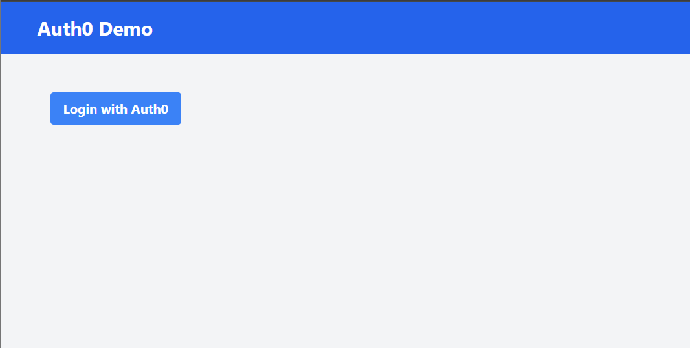
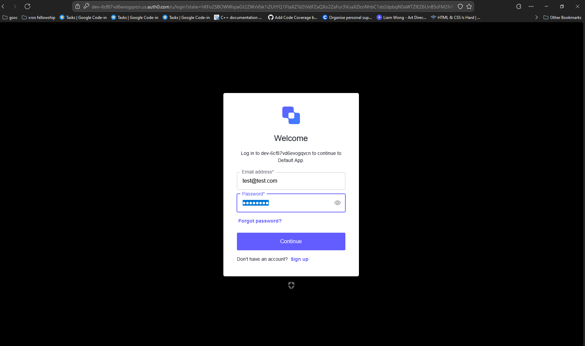
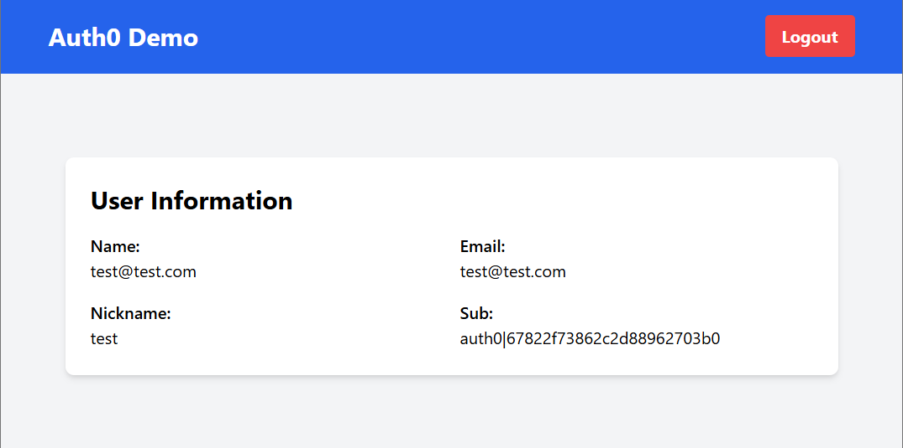

# OAuth 2.0 React Implementation Guide

Hey there! 👋 This guide will help you implement OAuth authentication in your React app using our custom OAuth client library. For this example, we’ll be using [Auth0](https://auth0.com/) as a provider.

## My understanding of the auth flow

- The user clicks on the login/sign-up CTA and gets redirected to a third-party authentication provider (like **Auth0**).
- The user fills in their credentials, grants necessary permissions, and completes the authentication process.
- The user is then redirected back to our site, either authenticated or with an error.
- During the redirect, the user returns with an **authorization code**, which is used by your auth client to exchange for an **access token** and potentially a **refresh token**.
- Finally, the user is either signed in with a valid session stored in **`localStorage`** or **`sessionStorage`**, or an error is thrown.

## Structure

Our project is divided into three main directories:

1. **auth**: Contains the core OAuth client library (`oauth-client.js`) that handles the OAuth flow logic.
2. **client**: Contains the React code that utilizes the OAuth client library to perform the OAuth 2.0 flow. In this directory, we instantiate the OAuth client and use React Context to manage authentication state.
3. **server**: Contains the Express app that handles server-side OAuth flows. Here, we set up cookies to securely store the access token and manage the authentication process server-side.

## Developer Checklist

- [x] Use your OAuth client library to implement a login flow
- [x] Include a login button that initiates the OAuth process
- [x] Handle the OAuth callback and securely manage tokens
- [x] Display user information after successful authentication
- [x] Ensure the library is platform-agnostic, capable of running in both browser and server environments without relying on browser-specific APIs

## Known Issue (Currently Being Worked On)

There is a known issue with the deployment of the application to production, specifically regarding the behavior of the OAuth callback in production environments.

- **Issue**: After a user authenticates successfully and is redirected back to the callback route, the user data appears temporarily in local environments (e.g., localhost), even after an error is logged in the console. However, in production, the user data doesn't appear at all after an error.

- **Current Status**: The issue seems to stem from differences in how the state is managed between local and production environments. I'm currently working on resolving this issue, as it seems to be related to either React's state management or routing behavior in production.

This issue only impacts the production environment at the moment and will be addressed soon.

## Live URLs

- **Frontend** - https://oauth2-client-library.vercel.app/
- **Backend** - https://oauth2-client-library.onrender.com

The backend is live and deployed, but there's a known issue within the Render community where, after deployment, fetch requests to the web service sometimes fail. The application works fine locally and displays all the necessary data, but I'm still working on a solution to resolve this issue as quickly as possible.

## Previews

1. 
2. 
3. 

## Local Set-Up

```bash
$ git clone https://github.com/SanyamPunia/oauth2-client-library
$ cd oauth2-client-library

# for client setup
$ cd client
$ npm install
$ npm start

# for backend setup
$ cd server
$ npm install
$ npm start
```

By default, frontend runs on the `PORT=3000`, & server runs on the `PORT=3001`
